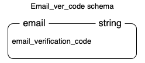
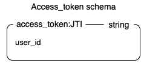
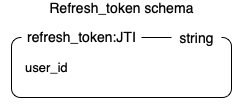

## Userland Application

Welcome to userland application 🎉🎉🎉

Userland appilication is a self-management application that has the following features:

- Registration
- Activation email
- Forget and reset password
- Login
- Manage basic information
- Manage profile picture
- Change email
- Change password
- Manage session
- Manage refresh token
- Manage access token
- Log user login information (using kafka)

## API Contract

For more information : https://userland.stoplight.io/docs/userland-api

## Technology Stack

1. Golang programming language (backend programming language)
2. Postgresql (database)
3. Redis (in-memory storage)
4. Postman (endpoints testing)
5. Mailtrap (email testing)
6. Adminer (database interface)
7. Kafka (exercise its publish and subscribe feature)
8. Docker-compose (configure application settings)

## Code Structure

This project used onion model architecture as the guidline to structure the code. This approach was chosen to avoid tightly coupled and separation of concerns issues which often happends in n-tear architecture. This model used interface to interact with other layers  and all the business and behaviour objects are placed in the centre of the layer which is in the domain model. This model is devided into four major layers which will be explained below:

1. Domain model

   As for this application, database as well as redis are placed under this layer. Folders that related to this layer are broker, postgres and redis under the store folder. Those folders are used to handle things related to creating, reading, updating as well as deleting data. 

2. Domain server

   This layer is used to create an abstraction to link between the application services layer and the domain model layer. As for my application, the files that related to this layer are token.go, user.go, postgres_connection.go as well as redis_connection.go under store folder.

3. Application service

   This layer is used to communicate between the UI layer and the domain layer. The example of this layer in my application is API folder. This folder has some subfolders which are

   - Handler folder

     This folder is used to handle all the coming request from the user interface and processing the request and return the appropriate response back to the user interface.

   - Validator folder

     This folder is used to validate all the requests from the user interface.

   - Jwt folder

     This folder is used to generate json web token, extract that token as well as validate it.

   - Response folder

     This folder is used to create templated response for the handler folder to return response to user interface.

   - Kafka_job folder

     This folder is used to create a worker which will receive user login information and publish it.

## Database schema

Below is how the database schema looks like


This application is formed from three entities and the database used is postgreSql. Below is the brief explanation for each entity.

1. Person entity

   This entity is used to store basic information about the user. This entity has a zero to many relationship with session entity. It means that one user might have zero or more session because user when user have not logged in, user won't have any session. Otherwise, when user logged in, that information will be stored to session table. This entity also has one to many relationship with user_password entity. It means that one user can have one or more password. Below is the postgreSql script for person entity:

```sql
CREATE TABLE IF NOT EXISTS "Person" (
	"id" UUID NOT NULL,
	"fullname" VARCHAR (128) NOT NULL,
	"password" VARCHAR (128) NOT NULL,
	"email" VARCHAR (128) UNIQUE NOT NULL,
	"location" VARCHAR (256),
	"bio" VARCHAR (256),
	"web" VARCHAR(128),
	"picture" VARCHAR (128),
	"created_at" TIMESTAMP NOT NULL,
	"is_active" BOOLEAN NOT NULL,
	PRIMARY KEY ("id")
) WITHOUT OIDS;
```

2. Session entity

   This entity is used to store user login information. This information includes the session id, time when user login, time when user refresh the session, user' ip address, user device as well as used id. This entity has a zero to many relationship with person entity as describe above. One user might have zero to many session and that session is only related to the particular person. Below is the postgreSql script for session entity:

```sql
CREATE TABLE IF NOT EXISTS "Session" (
	"id" UUID NOT NULL,
	"user_id" UUID NOT NULL,
	"ip_addres" VARCHAR (16) NOT NULL,
	"created_at" TIMESTAMP NOT NULL,
	"updated_at" TIMESTAMP,
	"device" VARCHAR (20) NOT NULL,
	PRIMARY KEY ("id"),
	CONSTRAINT "fk_user_id" FOREIGN KEY ("user_id") REFERENCES "Person" ("id") ON DELETE CASCADE ON UPDATE CASCADE
) WITHOUT OIDS;
```

3. User_password entity

   This entity is used to store information all the user' password that they have used in the system. This entity is made because of the requirement where user cannot change their password to the last three passwords that they have used. This entity has a one to many relationship with person entity. It means that one person can have one or more passwords as the user changing their password. Below is the postgreSql script for user_password entity:

```sql
CREATE TABLE IF NOT EXISTS "User_password" (
	"id" UUID NOT NULL,
	"password" VARCHAR (128) NOT NULL,
	"created_at" TIMESTAMP NOT NULL,
	CONSTRAINT "fk_id" FOREIGN KEY ("id") REFERENCES "Person" ("id") ON DELETE CASCADE ON UPDATE CASCADE
) WITHOUT OIDS;
```

4. Login_audit entity

   This entity is used to store user login information. This entity is made as an excercise to use kafka. When user logged in, user information about username (session id), ip_address as well as the login time will be published by the kafka. The subscriber is running using goroutine to always listen to any data that kafka publish and if there is data published, that data will be stored to this login_audit table. This entity has a one to many relationship with person entity. It means that one person can have one or more login information as the user login to the system. Below is the postgreSql script for login_audit entity:

```sql
CREATE TABLE IF NOT EXISTS "Login_audit" (
	"username" UUID NOT NULL,
	"ip_address" VARCHAR (16) NOT NULL,
	"created_at" TIMESTAMP NOT NULL,
	CONSTRAINT "fk_username" FOREIGN KEY ("username") REFERENCES "Person" ("id") ON DELETE CASCADE ON UPDATE CASCADE
) WITHOUT OIDS;
```

## Redis Schema

Redis was used in this application to store data that has expiration time such as the email verification code, access token as well as refresh token. Below is the brief explanation for each of the data.

1. Email_ver_code schema

   

   For this email verification code schema, string data structure was used. The key for this schema is email and the value for this schema is the email verification code. This data will be stored for only 60 seconds. Below is the redis script for this schema:

   To store data :

```
SETEX example@gmail.com 60 123456
```

 To get data :

```
GET example@gmail.com
```

2. Access token schema

   

   For this access token schema, string data structure was used. The key for this schema is access_token:jti and the value for this schema is user_id. This data will be stored for 30 minutes. Below is the redis script for this schema:

   To store data :

```
SETEX access_token:{jwt id} 1800 {user_id}
```

 To get data :

```
GET access_token:{jwt id}
```

3. Refresh token schema

   

   For this refresh token schema, string sata structure was used. The key for this schema is refresh_token:jti and the value for this schema is user_id. This data will be stored for 7 days. Below is the redis script for this schema:

   To store data :

```
SETEX refresh_token:{jwt id} 604800 {user_id}
```

 To get data :

```
GET refresh_token:{jwt id}
```

## To run the Program

1. Make sure docker is installed on your local
2. Run the docker
3. Create a .env file based on the .env.example file
4. Run the following command

```
docker-compose up
```

5. The server is listening to localhost:8080
